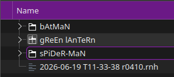

<div align="center">

<!-- ═══════════════════════════════════════════════════════════ -->
<!--                  CLEAN PROFESSIONAL HEADER                 -->
<!-- ═══════════════════════════════════════════════════════════ -->


<!-- TYPING ANIMATION -->
[](https://git.io/typing-svg)

<br/>

<!-- PROFILE VISITOR BADGE -->


</div>

---

<!-- ═══════════════════════════════════════════════════════════ -->
<!--                  ABOUT ME                                  -->
<!-- ═══════════════════════════════════════════════════════════ -->

## 🧑‍💻 About Me

```yaml
name     : Asim Ansari
role     : MLOps Developer · AI Solutions Engineer · Computer Vision Specialist
focus    : End-to-end AI pipelines, real-time CV systems, edge & cloud deployment
stack    : Python · PyTorch · OpenCV · YOLO · Docker · FastAPI · AWS · GCP · Azure
mission  : Deploying AI that sees, thinks & scales reliably in production
open_to  : Collaborations · Open Source · Freelance · Full-time
```

<!-- FUNNY CODING GIF -->
<div align="center">
  
</div>

---

<!-- ═══════════════════════════════════════════════════════════ -->
<!--                  TECH STACK                                -->
<!-- ═══════════════════════════════════════════════════════════ -->

## 🛠️ Tech Stack

<div align="center">

<a href="https://skillicons.dev">
  
</a>

<br/><br/>


</div>

---

<!-- ═══════════════════════════════════════════════════════════ -->
<!--                  STREAK STATS                              -->
<!-- ═══════════════════════════════════════════════════════════ -->

## 🔥 GitHub Streak

<div align="center">


</div>

---

<!-- ═══════════════════════════════════════════════════════════ -->
<!--          LIVE EXTENSIONS + FUNNY / VISUAL STUFF            -->
<!-- ═══════════════════════════════════════════════════════════ -->

## ⚡ Live Feed

<div align="center">

<!-- RANDOM DEV JOKE — new joke every page load (live API) -->
### 😂 Today's Dev Joke


<br/>

<!-- RANDOM PROGRAMMING QUOTE -->
### 💬 Today's Quote


<br/>

</div>

---

<!-- ═══════════════════════════════════════════════════════════ -->
<!--                 FUNNY RELATABLE SECTION                    -->
<!-- ═══════════════════════════════════════════════════════════ -->

## 🤣 Life as an AI Engineer

<div align="center">

<table>
<tr>
<td align="center" width="50%">

**When the model finally converges** 🎉


</td>
<td align="center" width="50%">

**When the GPU runs out of memory** 💀


</td>
</tr>
<tr>
<td align="center" width="50%">

**Me explaining AI to non-tech people** 🤖


</td>
<td align="center" width="50%">

**Pushing buggy code at 2AM** 🌙


</td>
</tr>
<tr>
<td align="center" width="50%">

**Model: 99% train, 12% test accuracy** 📉


</td>
<td align="center" width="50%">

**When Docker finally builds after 47 tries** 🐳


</td>
</tr>
</table>

<!-- AUTO-ROTATING DAILY MEME via GitHub Action -->
### 🐛 Meme of the Day *(auto-changes daily)*



</div>

---

## 🚀 Live Projects

<div align="center">

### 🌐 Portfolio — AI Solutions Engineer

[](https://ansari-asim.github.io/asim-portfolio/)


> Personal portfolio showcasing AI Solutions Engineering projects,
> Computer Vision work and MLOps deployments.

---

### 📘 AI Hardware Documentation — GPU & Jetson Guide

[](https://ansari-asim.github.io/GPU-Documentation/GPU/)


> Comprehensive AI hardware documentation covering NVIDIA Jetson devices
> (Nano, NX, TX2NX, Developer Kit), dGPU Ubuntu setup, OS transfers,
> BSP flashing, and edge deployment guides.

**Covered Hardware & Topics:**


</div>

---

<div align="center">

<!-- 3D ISOMETRIC CONTRIBUTION CALENDAR — beautiful visual -->
## 📅 Contribution Calendar


<br/>

<!-- ISOMETRIC 3D CONTRIBUTION -->


<br/>

</div>

<!-- ═══════════════════════════════════════════════════════════ -->
<!--                  SNAKE + QUOTE                             -->
<!-- ═══════════════════════════════════════════════════════════ -->

<div align="center">

<picture>
  <source media="(prefers-color-scheme: dark)" srcset="https://raw.githubusercontent.com/ansari-asim/ansari-asim/output/github-snake-dark.svg"/>
  <source media="(prefers-color-scheme: light)" srcset="https://raw.githubusercontent.com/ansari-asim/ansari-asim/output/github-snake.svg"/>
  
</picture>

</div>

---

<!-- ═══════════════════════════════════════════════════════════ -->
<!--                  CONNECT                                   -->
<!-- ═══════════════════════════════════════════════════════════ -->

## 🤝 Connect With Me

<div align="center">

[](https://linkedin.com/in/ansari-asim)
[](https://github.com/ansari-asim)
[](mailto:your@email.com)
[](https://ansari-asim.github.io/asim-portfolio/)

<br/>


</div>

<!--
╔══════════════════════════════════════════════════════════════╗
║          SETUP CHECKLIST — DELETE BEFORE PUBLISHING          ║
╠══════════════════════════════════════════════════════════════╣
║  1. Create PUBLIC repo named exactly: ansari-asim            ║
║  2. Update: Email, LinkedIn URLs                             ║
║  3. Snake: add .github/workflows/snake.yml                   ║
║  4. Hit badges auto-activate on first page visit             ║
║  5. 3D contrib: add yoshi-hirayama/github-profile-3d-contrib ║
║     GitHub Action workflow                                   ║
╚══════════════════════════════════════════════════════════════╝
-->
